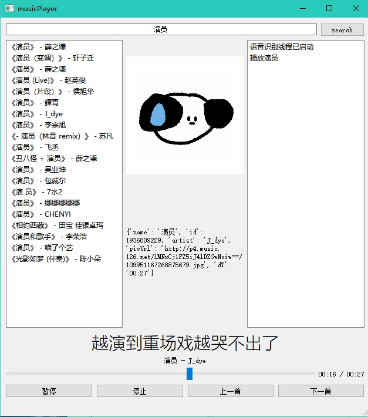

# PyQT + PyNcm + PyAudio + 讯飞实时语音转写的音乐播放器

### 使用说明

打开讯飞，注册应用然后申请免费的 [实时语音转写](https://www.xfyun.cn/services/rtasr?target=price) ，获取到`app_id`和`api_key`

在`main.py`中写入讯飞平台的`app_id`和`api_key`，然后运行即可。

支持的命令：

- 播放
- 暂停
- 上一首 / 下一首
- 播放xxxxx
- 搜索xxxxx

### 项目来源

某音有个博主这几天成天的发自己写的播放器，我说了句我初中就会写了然后问了句这东西还能赚钱？，然后被拉黑了......

行吧......

